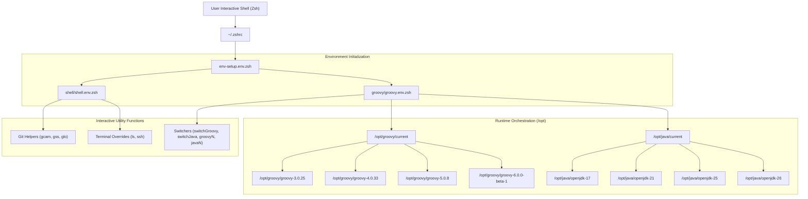

# System Architecture and Design

Comprehensive architectural specification for the `env-setup` multi-runtime development orchestration framework.

---

## 1. Overview and Core Philosophy

`env-setup` is a multi-platform runtime orchestration and environment management framework designed for POSIX-compliant operating systems (macOS and Linux distributions, including Enterprise Linux / Rocky, Ubuntu/Debian, Arch, openSUSE, and Alpine).

The system addresses the complexities of managing concurrent multi-version language runtimes (Apache Groovy 3, 4, 5, 6), multi-major OpenJDK distributions (Java 17, 21, 25, 26), system package managers, and unified developer shell tooling without relying on heavy virtualization, container overhead, or fragile global version managers.



---

## 2. Core Architectural Principles

1. **Zero Global Pollution**: Runtimes are isolated inside dedicated root prefixes (`/opt/groovy` and `/opt/java`). System binaries outside of managed prefixes are never overwritten.
2. **Atomic Symlink Switching**: Active runtime selection is governed by symbolic links (`/opt/groovy/current` and `/opt/java/current`). Switching versions updates symlinks and environment variables simultaneously without reinstallation or process restart.
3. **Single Unified Sourcing Entrypoint**: Shell configuration is consumed via a single, idempotent block inside `~/.zshrc` pointing to `env-setup.env.zsh`, eliminating configuration fragmentation across disparate shell startup files.
4. **Idempotent Automation**: All setup, installation, and update scripts can be re-run indefinitely without causing duplicate configuration blocks, corrupted symlinks, or redundant network transfers.
5. **Cross-Platform Parity**: macOS (Darwin) and Linux (WSL, Enterprise Linux, Debian, Arch) share identical function interfaces, version aliases, and verification suites.

---

## 3. Filesystem Topology

```
/opt/
├── groovy/
│   ├── current -> /opt/groovy/groovy-6.0.0-beta-1
│   ├── groovy-3.0.25/
│   ├── groovy-4.0.33/
│   ├── groovy-5.0.8/
│   └── groovy-6.0.0-beta-1/
└── java/
    ├── current -> /opt/java/openjdk-26
    ├── openjdk-17/
    ├── openjdk-21/
    ├── openjdk-25/
    └── openjdk-26/

/home/<user>/repos/env-setup/
├── .gitattributes             # Git LF line-ending normalization rules
├── env-setup.env.zsh          # Single unified sourcing entrypoint
├── brew/                      # Homebrew / Linuxbrew formula & cask subsystem
│   ├── config.defaults        # Default package lists (formulae and casks)
│   ├── install-homebrew.sh    # Non-interactive Homebrew/Linuxbrew installer
│   ├── setup.sh               # Formula & cask installation orchestrator
│   ├── update-brew.sh         # Package upgrade manager
│   ├── verify.sh              # Verification and health check suite
│   └── lib/common.sh          # Package manager and path discovery routines
├── docs/                      # Technical documentation suite
├── groovy/                    # Apache Groovy orchestration subsystem
│   ├── config.defaults        # Pinned versions and repository endpoints
│   ├── config.darwin.sh       # macOS platform configuration
│   ├── config.linux.sh        # Linux Adoptium API platform configuration
│   ├── groovy.env.zsh         # Dynamic version switchers and shell hooks
│   ├── setup.sh               # Multi-version Groovy installation engine
│   ├── update-groovy.sh       # In-place version upgrades & rollback engine
│   ├── verify.sh              # Groovy environment verification suite
│   ├── versions.conf          # Pinned version mappings
│   └── lib/
│       ├── common.sh          # Archive downloading, checksumming, extraction
│       ├── logging.sh         # ANSI color-coded TTY logging subsystem
│       └── platform.sh        # Architecture discovery & Adoptium/macOS backends
├── java/                      # OpenJDK multi-major orchestration subsystem
│   ├── config.defaults        # JDK definitions & directory pointers
│   ├── setup.sh               # JDK provisioning engine
│   ├── update-java.sh         # JDK update manager
│   ├── verify.sh              # JDK verification suite
│   └── versions.conf          # Java major version mapping definitions
├── scripts/                   # Compatibility & automated test matrix suites
│   ├── test-all-groovy-jdks.sh # Full Groovy × JDK matrix test suite
│   ├── test-groovy-jdks.sh     # Single-version JDK compatibility runner
│   └── test-shell-functions.sh # Interactive shell functions validation suite
└── shell/                     # Interactive shell utilities and tool provisioning
    ├── config.defaults        # Shell functions and tool package names
    ├── setup.sh               # Zsh, Nano, and ~/.zshrc hook bootstrapper
    ├── shell.env.zsh          # Interactive Git, SSH, and LS utility functions
    ├── verify.sh              # Zsh runtime function validator
    └── lib/common.sh          # Linux package manager discovery & installer
```

---

## 4. Platform Abstraction Layer (PAL)

The platform abstraction layer isolates operating system variances behind unified shell interfaces:

| Subsystem | macOS (Darwin) Backend | Linux Backend (Rocky / Ubuntu / Arch) |
|---|---|---|
| **JDK Management** | Homebrew Keg Discovery (`/opt/homebrew/opt/openjdk@N`) | Eclipse Adoptium API v3 automated tarball download & extraction |
| **Package Management** | Native Homebrew (`/opt/homebrew/bin/brew`) | Native Linux package managers (`dnf`, `apt-get`, `yum`, `pacman`, `zypper`) + Linuxbrew (`/home/linuxbrew/.linuxbrew/bin/brew`) |
| **GUI Casks** | Supported via `brew install --cask` | Automatically bypassed with informational logging |
| **CLI Tool Provisioning** | Homebrew formula installation | Native package manager installation with automatic `sudo` escalation |
| **Path Resolution** | `/opt/homebrew/bin` | `/home/linuxbrew/.linuxbrew/bin`, `/usr/bin`, `/usr/local/bin` |

---

## 5. Security and Privilege Model

- **Non-Root Execution**: Development runtimes under `/opt/groovy` and `/opt/java` are owned by the developer user (`gmb:gmb`), preventing the need for `sudo` during regular operations, version switches, or script runs.
- **Controlled Privilege Escalation**: Privilege elevation (`sudo`) is requested only during initial system package provisioning (`dnf install`, `apt-get install`) if the user is unprivileged.
- **Fail-Safe Sourcing**: Sourcing scripts (`env-setup.env.zsh`, `groovy.env.zsh`, `shell.env.zsh`) contain execution guards against non-Zsh environments and unaliasing errors (`|| true`), preventing terminal startup crashes.