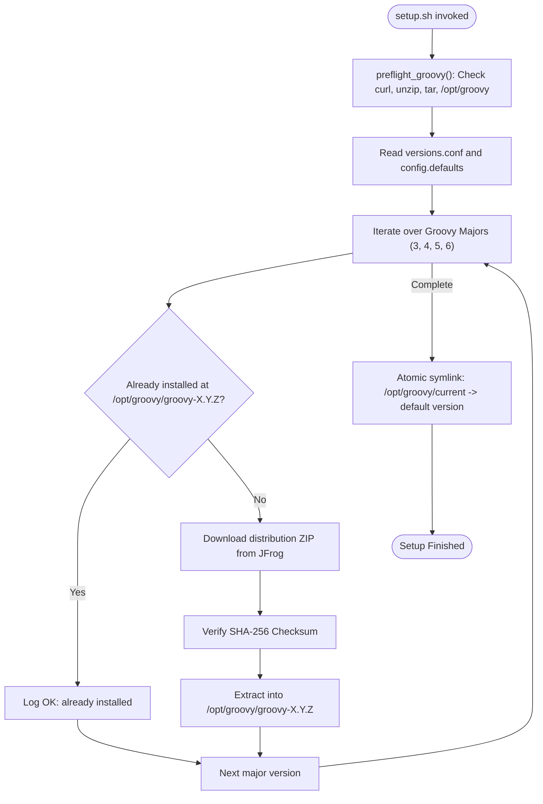

# Groovy Module Documentation

Deep dive into the architecture, implementation, and operations of the Apache Groovy subsystem (`groovy/`).

---

## 1. Module Overview

The Groovy module orchestrates the installation, dynamic version switching, automated upgrading, and health verification for multiple Apache Groovy major releases.

### Key Objectives
- Support concurrent installations of Groovy 3, 4, 5, and 6.
- Enforce strict JDK compatibility mapping per major version.
- Enable instant version switching without subshell overhead or file copying.
- Support safe upgrades with `--rollback` and `--dry-run` capabilities.

---

## 2. File Manifest

| File | Type | Description |
|---|---|---|
| [`groovy/setup.sh`](file:///rocky/home/gmb/repos/env-setup/groovy/setup.sh) | Executable Script | Bootstraps all configured Groovy major versions, unpacks zip archives to `/opt/groovy`, and configures default symlinks. |
| [`groovy/verify.sh`](file:///rocky/home/gmb/repos/env-setup/groovy/verify.sh) | Executable Script | Validates directory existence, permissions, JDK linkages, active symlinks, and executes `groovy -v`. |
| [`groovy/update-groovy.sh`](file:///rocky/home/gmb/repos/env-setup/groovy/update-groovy.sh) | Executable Script | In-place version upgrader supporting single-major target upgrades, cleanup of obsolete versions (`--clean`), and state rollback (`--rollback`). |
| [`groovy/versions.conf`](file:///rocky/home/gmb/repos/env-setup/groovy/versions.conf) | Configuration | Pinned version definitions and active version identifier. |
| [`groovy/config.defaults`](file:///rocky/home/gmb/repos/env-setup/groovy/config.defaults) | Configuration | Download URL patterns (JFrog distribution mirrors), checksum URLs, and default installation roots. |
| [`groovy/config.darwin.sh`](file:///rocky/home/gmb/repos/env-setup/groovy/config.darwin.sh) | Platform Config | macOS-specific JDK discovery parameters and Homebrew paths. |
| [`groovy/config.linux.sh`](file:///rocky/home/gmb/repos/env-setup/groovy/config.linux.sh) | Platform Config | Linux-specific Adoptium API endpoint configuration. |
| [`groovy/groovy.env.zsh`](file:///rocky/home/gmb/repos/env-setup/groovy/groovy.env.zsh) | Shell Hook | Defines `switchGroovy`, `switchJava`, `groovy3`-`groovy6`, `java17`-`java26`, auto-links missing JDKs, and prints startup banners. |
| [`groovy/lib/common.sh`](file:///rocky/home/gmb/repos/env-setup/groovy/lib/common.sh) | Library | Archive downloading, SHA-256 validation, unzipping, preflight dependency checks (`curl`, `unzip`, `tar`, `gzip`), and error dispatchers. |
| [`groovy/lib/platform.sh`](file:///rocky/home/gmb/repos/env-setup/groovy/lib/platform.sh) | Library | Architecture detection (`x86_64`, `aarch64`), Adoptium download URL resolution, and cross-platform JDK installation routines. |
| [`groovy/lib/logging.sh`](file:///rocky/home/gmb/repos/env-setup/groovy/lib/logging.sh) | Library | ANSI color-coded TTY logger providing `log_info`, `log_error`, `log_warn`, and `log_debug`. |

---

## 3. Installation Flow (`setup.sh`)

---

## 4. Upgrading and Rollback Subsystem (`update-groovy.sh`)

`update-groovy.sh` allows updating any individual Groovy major version to a new point release without disrupting other installations:

### Key Operations
- **Dry Run (`--dry-run`)**: Simulates download, extraction, and symlink update without performing changes.
- **Rollback (`--rollback`)**: Reverts `/opt/groovy/current` and `versions.conf` to the state prior to the last update.
- **Clean (`--clean`)**: Removes superseded Groovy point releases from `/opt/groovy` after a successful upgrade.

---

## 5. Verification Subsystem (`verify.sh`)

`verify.sh` performs non-destructive assertions:
1. `GROOVY_ROOT` exists and is writable.
2. `JAVA_ROOT` exists and is accessible.
3. `versions.conf` contains valid major mappings.
4. Each configured Groovy version directory exists and contains `bin/groovy`.
5. Active `/opt/groovy/current` symlink resolves to a valid executable.
6. Executes `groovy -v` through `/opt/groovy/current/bin/groovy` and parses version output.