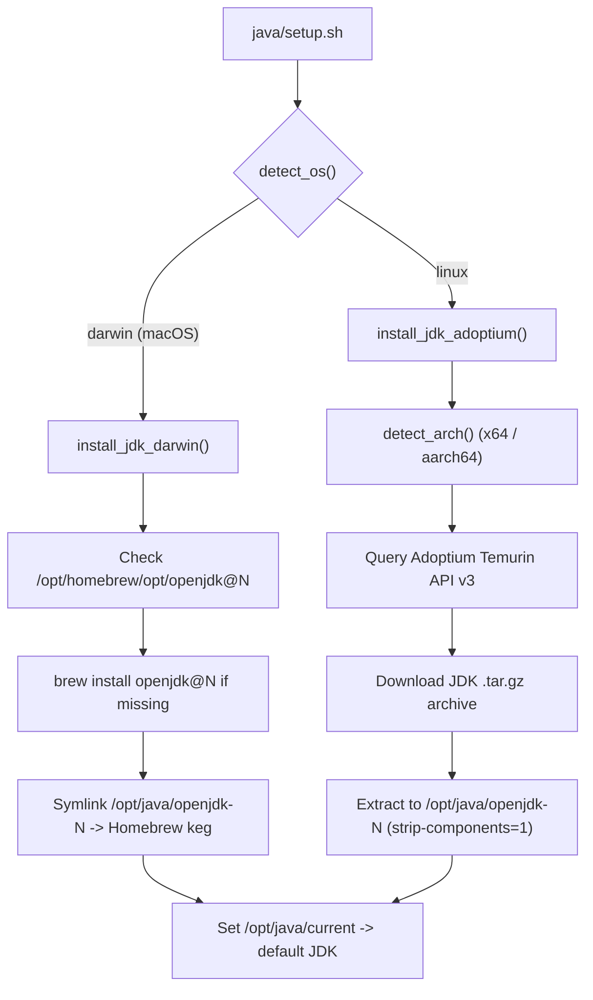

# Java Module Documentation

Technical specification of the multi-major OpenJDK management subsystem (`java/`).

---

## 1. Module Overview

The Java module manages concurrent installations of OpenJDK runtimes (Java 17, 21, 25, 26) inside `/opt/java`. It isolates JDK binaries from system Java packages and provides uniform discovery mechanisms across macOS and Linux.

---

## 2. File Manifest

| File | Type | Description |
|---|---|---|
| [`java/setup.sh`](file:///rocky/home/gmb/repos/env-setup/java/setup.sh) | Executable Script | Dispatches JDK installation for configured majors (17, 21, 25, 26) via platform backend. |
| [`java/verify.sh`](file:///rocky/home/gmb/repos/env-setup/java/verify.sh) | Executable Script | Validates all installed JDK paths, `/opt/java/current` symlink, and runs `java -version`. |
| [`java/update-java.sh`](file:///rocky/home/gmb/repos/env-setup/java/update-java.sh) | Executable Script | Upgrades configured JDK versions using platform backends. |
| [`java/versions.conf`](file:///rocky/home/gmb/repos/env-setup/java/versions.conf) | Configuration | Configures installed JDK major list and default active version. |
| [`java/config.defaults`](file:///rocky/home/gmb/repos/env-setup/java/config.defaults) | Configuration | Defines installation path prefix `/opt/java` and Homebrew/Adoptium endpoint defaults. |

---

## 3. Platform Backend Implementation

### 3.1 macOS Backend (Homebrew Integration)
On macOS, OpenJDK is provisioned via Homebrew kegs:
- JDK 17 -> `/opt/homebrew/opt/openjdk@17/libexec/openjdk.jdk/Contents/Home`
- JDK 21 -> `/opt/homebrew/opt/openjdk@21/libexec/openjdk.jdk/Contents/Home`
- JDK 25 -> `/opt/homebrew/opt/openjdk/libexec/openjdk.jdk/Contents/Home`
- JDK 26 -> `/opt/homebrew/opt/openjdk/libexec/openjdk.jdk/Contents/Home`

### 3.2 Linux Backend (Adoptium API Integration)
On Linux (including WSL2 Rocky/Ubuntu), the module queries the Eclipse Adoptium API v3:
- Endpoint: `https://api.adoptium.net/v3/binary/latest/${feature_version}/ga/linux/${arch}/jdk/hotspot/normal/eclipse`
- Dynamic resolution: Automatically selects the latest GA release for architecture `x64` or `aarch64`.
- Unpacking: Uses `tar -xzf <archive> --strip-components=1 -C /opt/java/openjdk-XX` to provide consistent directory structures.

---

## 4. Verification Subsystem (`verify.sh`)

Checks executed by `verify.sh`:
1. `JAVA_ROOT` exists (`/opt/java`).
2. `versions.conf` exists and is non-empty.
3. Every configured JDK directory (`openjdk-17`, `openjdk-21`, `openjdk-25`, `openjdk-26`) exists and contains `bin/java` and `bin/javac`.
4. `/opt/java/current` exists and links to a valid JDK directory.
5. Executes `/opt/java/current/bin/java -version` and verifies output format.