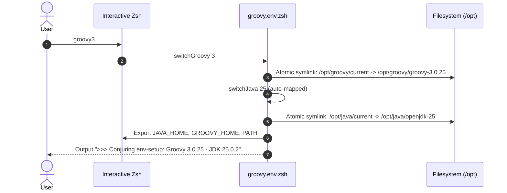

# Functional Specifications

Formal functional and behavioral specification for the `env-setup` runtime environment.

---

## 1. Runtime Versions and Matrix Mapping

`env-setup` orchestrates four major releases of Apache Groovy alongside four Long-Term Support (LTS) and feature releases of OpenJDK.

### 1.1 Installed Runtime Matrix

| Major | Pinned Release | Installation Path | Target JDK | JDK Compatibility Range | Bytecode Target |
|:---:|:---:|---|:---:|:---:|:---:|
| **Groovy 3** | `3.0.25` | `/opt/groovy/groovy-3.0.25` | OpenJDK 25 | JDK 8 – JDK 25 | Java 8 (52.0) |
| **Groovy 4** | `4.0.33` | `/opt/groovy/groovy-4.0.33` | OpenJDK 26 | JDK 11 – JDK 26 | Java 11 (55.0) |
| **Groovy 5** | `5.0.8` | `/opt/groovy/groovy-5.0.8` | OpenJDK 26 | JDK 17 – JDK 26 | Java 17 (61.0) |
| **Groovy 6** | `6.0.0-beta-1` | `/opt/groovy/groovy-6.0.0-beta-1` | OpenJDK 26 | JDK 17 – JDK 26 | Java 17 (61.0) |

### 1.2 OpenJDK Distribution Matrix

| Major ID | Release Version | Installation Path | Backend Source (macOS) | Backend Source (Linux) |
|:---:|:---:|---|---|---|
| `17` | `17.0.18+8` (LTS) | `/opt/java/openjdk-17` | Homebrew `openjdk@17` | Adoptium Temurin API v3 |
| `21` | `21.0.10+7` (LTS) | `/opt/java/openjdk-21` | Homebrew `openjdk@21` | Adoptium Temurin API v3 |
| `25` | `25.0.2+10` | `/opt/java/openjdk-25` | Homebrew `openjdk` (keg) | Adoptium Temurin API v3 |
| `26` | `26.0.2.1+1` | `/opt/java/openjdk-26` | Homebrew `openjdk` (current) | Adoptium Temurin API v3 |

---

## 2. Dynamic Runtime Switcher Subsystem

The shell environment provides dynamic, interactive functions to swap active runtime versions within the current shell session.

### 2.1 Switcher Functions

### 2.2 Function Interface Specification

#### `switchGroovy <major|full-version>`
- **Behavior**: Updates `/opt/groovy/current` symlink to target directory.
- **Side Effects**: Automatically identifies and activates the maximum supported JDK for the selected Groovy release (e.g. Groovy 3 activates JDK 25; Groovy 4/5/6 activate JDK 26).
- **Environment Updates**: Exports `GROOVY_HOME=/opt/groovy/current`, prepends `/opt/groovy/current/bin` to `PATH`, prints conjuring banner.
- **Convenience Shorthands**: `groovy3`, `groovy4`, `groovy5`, `groovy6`.

#### `switchJava <major|full-version>`
- **Behavior**: Updates `/opt/java/current` symlink to target JDK directory.
- **Environment Updates**: Exports `JAVA_HOME=/opt/java/current`, prepends `/opt/java/current/bin` to `PATH`, prints status confirmation.
- **Convenience Shorthands**: `java17`, `java21`, `java25`, `java26`.

---

## 3. Interactive Shell Utilities

The [`shell/shell.env.zsh`](file:///rocky/home/gmb/repos/env-setup/shell/shell.env.zsh) module defines productivity functions that override basic aliases with intelligent shell functions.

| Function | Signature / Usage | Behavior and Flags |
|---|---|---|
| `ls` | `ls [options] [path]` | In interactive terminals, executes `ls -G` (macOS color) or `ls --color=auto` (Linux color). Preserves piping transparency in scripts. |
| `ssh` | `ssh [args...]` | Invokes `TERM=xterm /usr/bin/ssh "$@"` ensuring consistent terminal capability negotiation on remote servers. |
| `gss` | `gss` | Executes `git status --short`. |
| `glo` | `glo` | Executes `git log --oneline -10`. |
| `gcam` | `gcam [-d\|--dry-run] <message>` | Stages all modified and deleted files and creates a commit. Supports `--dry-run` to preview the command without mutating git state. |

---

## 4. Package Provisioning Specification

### 4.1 Native Linux Package Manager Discovery

[`shell/lib/common.sh`](file:///rocky/home/gmb/repos/env-setup/shell/lib/common.sh) inspects the host environment in priority order:
1. `dnf` (Fedora, RHEL 8+, Rocky Linux, AlmaLinux) -> `sudo dnf install -y <pkg>`
2. `apt-get` (Debian, Ubuntu, Linux Mint) -> `sudo apt-get update && sudo apt-get install -y <pkg>`
3. `yum` (CentOS 7, Amazon Linux) -> `sudo yum install -y <pkg>`
4. `pacman` (Arch Linux, Manjaro) -> `sudo pacman -S --noconfirm <pkg>`
5. `zypper` (openSUSE, SLES) -> `sudo zypper install -y <pkg>`
6. `brew` (Linuxbrew standalone) -> `brew install <pkg>`

### 4.2 Homebrew / Linuxbrew Formulae

Configured in [`brew/config.defaults`](file:///rocky/home/gmb/repos/env-setup/brew/config.defaults):
- Formulae: `tree`, `gh`, `awscli@2`, `kubectl`, `helm`, `python3`, `argocd`, `sshpass`, `node`, `nano`.
- Casks (macOS only): `nimble-commander`, `wezterm`, `lens`, `freelens`.